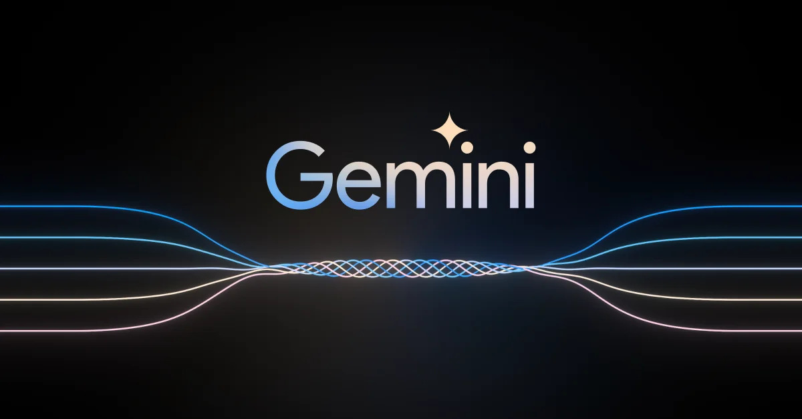

# Imersão IA Alura & Google 2024
Repositório voltado para a documentação do evento!

## Índice
🤔 O que é a Imersão IA Alura & Google?

👩🏼‍💻 Assuntos abordados e desafios propostos

🛠 Ferramentas utilizadas

🙇🏼‍♀️ Agradecimentos 

   
## 🤔 O que é a Imersão IA Alura & Google?
O projeto tem como objetivo introduzir e ensinar os principais fundamentos da Inteligência Artificial Generativa, desde Engenharia de Prompt até a criação de programas usando o Gemini, IA da Google. O evento ocorreu de 06/05/24 a 10/05/24, havendo lives de abertura, introdução ao Python e encerramento nos dias 03, 08 e 13 de maio, respectivamente. 

## 👩🏼‍💻 Assuntos abordados e desafios propostos
- [Aula 01: Mergulhando no Gemini, a IA do Google](https://github.com/rafaelatn/Imersao-IA-Alura-Google/blob/main/Aula%2001%3A%20Mergulhando%20no%20Gemini%2C%20a%20IA%20do%20Google/Aula%2001%3A%20Anota%C3%A7%C3%B5es%20e%20Desafios.md)
- [Aula 02: Melhores técnicas em Engenharia de Prompt](https://github.com/rafaelatn/Imersao-IA-Alura-Google/blob/main/Aula%2002%3A%20Melhores%20t%C3%A9cnicas%20em%20Engenharia%20de%20Prompt/Aula%2002%3A%20Anota%C3%A7%C3%B5es%20e%20Desafios.md)
- [Aula 03: Explorando os parâmetros do Google IA Studio](https://github.com/rafaelatn/Imersao-IA-Alura-Google/blob/main/Aula%2003%3A%20Explorando%20os%20par%C3%A2metros%20do%20Google%20IA%20Studio/Aula%2003%3A%20Anota%C3%A7%C3%B5es%20e%20Desafios.md)
- [Aula 04: Criando seu próprio chatbot com a Gemini API no Google Colab](https://github.com/rafaelatn/Imersao-IA-Alura-Google/blob/main/Aula%2004:%20Criando%20seu%20pr%C3%B3prio%20chatbot%20com%20a%20Gemini%20API%20no%20Google%20Colab/Aula%2004:%20Anota%C3%A7%C3%B5es%20e%20Desafios.md)
- [Aula 05: Criando um sistema para busca em documentos usando embeddings e a Gemini API](https://github.com/rafaelatn/Imersao-IA-Alura-Google/blob/main/Aula%2005%3A%20Criando%20um%20sistema%20para%20busca%20em%20documentos%20usando%20embeddings%20e%20a%20Gemini%20API/Aula%2005%3A%20Anota%C3%A7%C3%B5es%20e%20Desafios.md)
- [Introdução ao Python - Live](https://github.com/rafaelatn/Imersao-IA-Alura-Google/tree/main/Introdu%C3%A7%C3%A3o%20ao%20Python%20-%20Live)
## 🛠 Ferramentas utilizadas
- [Gemini](https://gemini.google.com/app)
- [Google AI Studio](https://aistudio.google.com)
- [Google Colab](https://colab.google/)
  
## 🙇🏼‍♀️ Agradecimentos 
Agradeço à Alura pela oportunidade de expandir meus conhecimentos sobre Inteligência Artificial e tecnologia em geral, com um time estruturado e engajado na proposta. Agradeço também à alguns amigos da robótica, que me apoiaram e me ajudaram nessa jornada totalmente desconhecida.

